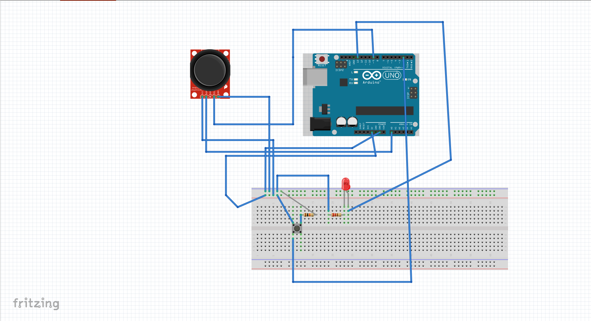

# Greetings

I am very excited to publish my first Rust project which enable to control Arduino and send commands to another <a href="https://github.com/01mk027/rust-ggez-game">game which is written in Rust.</a>

# Circuit and game video

<video width="640" height="480" controls>
  <source src="mainVideo_V1.mp4" type="video/mp4">
Your browser does not support the video tag.
</video>

# Brief info

To run Rust code in Arduino, as a first step I visited<a href="https://blog.logrocket.com/complete-guide-running-rust-arduino/">this website</a> (Port configuration plays important role in this case).

After making some tests (led blinking) from <a href="https://github.com/Rahix/avr-hal/tree/main/examples">here</a>, i wrote two of apps (others <a href="https://github.com/01mk027/rust-ggez-game">link is this</a>) within approximately two months.

# Information for pins and components

<table>
   <thead>
   <tr>
      <td>Pin</td>
      <td>Functionality</td>
   </tr>
   </thead>
   <tbody>
      <tr><td>2</td><td><i>Used for button actions</i></td></tr>
      <tr><td>9</td><td><i>Used for joystick</i></td></tr>  
      <tr><td>13</td><td><i>Used for led (indicates firing)</i></td></tr>
      <tr><td>A0</td><td><i>Used for joystick</i></td></tr>
   </tbody>
</table>

Resistor of LED is 220 Ohm, and resistor of joystick is 10000 Ohm

# Overview

Aim of this project is send some signal to <a href="https://github.com/01mk027/rust-ggez-game">game</a> via serial port in format of 

Vy(integer), Vx(integer), IsButtonPressed (tinyint 0/1) 

Delay duration of Arduino is 50ms. After end of every 50 ms, signals are sent in written format.

